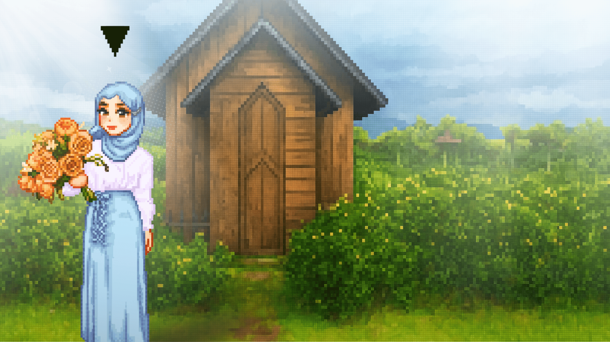

  

---

I’m **Nursila Yusmitha**, a **Web Developer & Creative Technologist** passionate about blending creativity with technology.  
I love building digital experiences that mix **anything-inspired aesthetics 🎨** with **modern web technologies ⚡**,  
making projects that feel alive, unique, and meaningful.  

✨ I value clean code, teamwork, and continuous learning.  
✨ I enjoy solving problems, designing intuitive interfaces, and experimenting with creative approaches.  
✨ Beyond coding, I dive into design, storytelling, and media as tools to connect people and ideas.  
✨ For me, technology is not just functional—it’s a canvas for creativity, collaboration, and innovation.  

---

  <!-- Baris 1 -->
  
  
  
  
  
  
  

  <!-- Baris 2 -->
  
  
  
  
  
  
  

  <!-- Baris 3 -->
  
  
  
  
  
  
  

  <!-- Baris 4 -->
  
  

---

  

  
  

---

  <table>
    <tr>
      <td width="75%">
        
      </td>
    <td width="25%" valign="top" align="center">
  
    

 

  
    
  
    
  
    
  
    
  

</td>

  </tr>
  </table>

---

  ⭐ If you like my projects, don’t forget to star the repo! ⭐  

